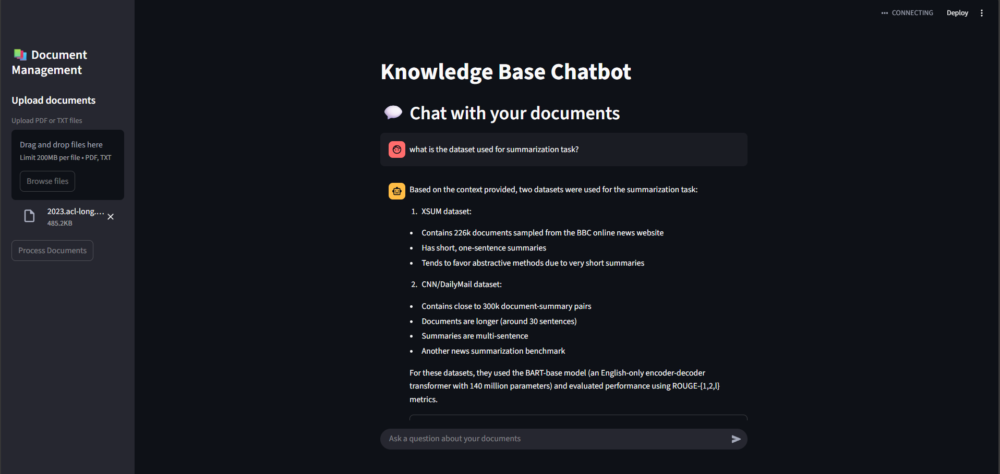

# 🧠 AI-Powered Knowledge Base Chatbot

<div align="center">

[](https://python.org)
[](https://streamlit.io)
[](https://langchain.com)
[](https://anthropic.com)

*Transform your documents into an intelligent, conversational knowledge base*

</div>

## 🚀 Overview

This **AI-Powered Knowledge Base Chatbot** revolutionizes how organizations interact with their document repositories. Built with cutting-edge AI technologies, it enables natural language conversations with your PDF and text documents, providing instant, contextual answers backed by source citations.

**Perfect for:**

- 📊 **Data Teams** - Query research papers, documentation, and reports
- 🏢 **Enterprise Knowledge Management** - Centralized document intelligence
- 🎯 **Business Intelligence** - Extract insights from company documents
- 📚 **Research & Development** - Accelerate information discovery

## ✨ Key Features

### 🔍 **Intelligent Document Processing**

- **Multi-format Support**: PDF and TXT document ingestion
- **Smart Chunking**: Optimized text segmentation for better retrieval
- **Vector Embeddings**: State-of-the-art sentence transformers for semantic search

### 💬 **Conversational AI Interface**

- **Natural Language Queries**: Ask questions in plain English
- **Context-Aware Responses**: Maintains conversation history for coherent interactions
- **Source Attribution**: Every answer includes relevant document citations
- **Real-time Processing**: Instant responses with visual loading indicators

### 🛠 **Enterprise-Ready Architecture**

- **Scalable Vector Database**: ChromaDB for efficient similarity search
- **Advanced LLM Integration**: Powered by Anthropic's Claude 3.5 Haiku
- **Memory Management**: Conversation buffer for context retention
- **Modular Design**: Clean separation of concerns for maintainability

### 🎨 **Intuitive User Experience**

- **Streamlit Interface**: Modern, responsive web application
- **Drag-and-Drop Upload**: Effortless document management
- **Chat History**: Persistent conversation threads
- **Source Exploration**: Expandable source document previews

## 🖥️ Interface



## 🏗 Technical Architecture

```
┌─────────────────┐    ┌──────────────────┐    ┌─────────────────┐
│   Streamlit UI  │───▶│  Document Loader │───▶│   Text Splitter │
└─────────────────┘    └──────────────────┘    └─────────────────┘
                                                         │
┌─────────────────┐    ┌──────────────────┐    ┌─────────────────┐
│   Claude 3.5    │◀───│  Retrieval Chain │◀───│  Vector Store   │
│     Haiku       │    │   (LangChain)    │    │   (ChromaDB)    │
└─────────────────┘    └──────────────────┘    └─────────────────┘
```

## 🚀 Getting Started

### Prerequisites

- Python 3.11 or higher
- Anthropic API key

### Installation

1. **Clone the repository**

   ```bash
   git clone https://github.com/yourusername/kb-chatbot.git
   cd kb-chatbot
   ```

2. **Set up Python environment**

   ```bash
   # Using uv (recommended)
   uv sync
   ```

3. **Configure environment variables**

   ```bash
   cp .env.example .env
   # Edit .env and add your Anthropic API key
   echo "ANTHROPIC_API_KEY=your_api_key_here" >> .env
   ```

4. **Launch the application**

   ```bash
   streamlit run app.py
   ```

5. **Access the interface**
   Open your browser to `http://localhost:8501`

### Quick Start Guide

1. **Upload Documents**: Use the sidebar to upload PDF or TXT files
2. **Process Documents**: Click "Process Documents" to create the knowledge base
3. **Start Chatting**: Ask questions about your documents in natural language
4. **Explore Sources**: Click on source citations to view relevant document excerpts

## 📋 Usage Examples

### Business Intelligence Queries

```
"What are the key performance metrics mentioned in the Q3 report?"
"Summarize the main risks identified in our compliance documentation"
"What budget allocations were discussed for the marketing department?"
```

### Research & Development

```
"What methodologies were used in the machine learning research papers?"
"Compare the experimental results across different studies"
"What are the limitations mentioned in the technical documentation?"
```

### Policy & Compliance

```
"What are the requirements for data privacy compliance?"
"Summarize the employee handbook policies on remote work"
"What security protocols are outlined in our IT documentation?"
```

## 🔧 Configuration

### Environment Variables

```env
ANTHROPIC_API_KEY=your_anthropic_api_key
```

### Customization Options

- **Chunk Size**: Modify `chunk_size` in `chatbot.py:57`
- **Retrieval Count**: Adjust `k` parameter in `chatbot.py:65`
- **Model Selection**: Change Claude model in `chatbot.py:26`

## 🛠 Development

### Project Structure

```
kb-chatbot/
├── app.py              # Streamlit web interface
├── chatbot.py          # Core chatbot logic
├── pyproject.toml      # Project dependencies
└── .env.example        # Environment template
```

### Key Components

- **`KnowledgeBaseChatbot`**: Main chatbot class handling document processing and Q&A
- **Document Loaders**: PDF and text file processing utilities
- **Vector Store**: ChromaDB integration for semantic search
- **Conversation Chain**: LangChain orchestration for retrieval-augmented generation

## 🚀 Deployment

### Local Development

```bash
streamlit run app.py
```

### Docker Deployment

```bash
docker build -t kb-chatbot .
docker run -p 8501:8501 kb-chatbot
```

Still underconstruction

### Cloud Deployment

Compatible with:

- Streamlit Cloud
- AWS EC2/ECS
- Google Cloud Run
- Azure Container Instances

## 🤝 Contributing

Contributions are welcomed!

1. Fork the repository
2. Create a feature branch
3. Make your changes
4. Add tests if applicable
5. Submit a pull request

## 📄 License

This project is licensed under the MIT License - see the [LICENSE](LICENSE) file for details.

## 🙏 Acknowledgments

- **Anthropic** for Claude 3.5 Haiku LLM
- **LangChain** for the RAG framework
- **LangGraph** for the RAG framework
- **Streamlit** for the web interface
- **ChromaDB** for vector storage
- **Hugging Face** for embedding models

## 📞 Support

- 📧 Discord: andreaschandra#4851
- 💬 Issues: [GitHub Issues](https://github.com/andreaschandra/kb-chatbot/issues)
- 📖 Documentation: [Wiki](https://github.com/andreaschandra/kb-chatbot/wiki)

---

<div align="center">

**Built with ❤️ for intelligent document interaction**

[⭐ Star this repository](https://github.com/andreaschandra/kb-chatbot) if you find it helpful!

</div>
